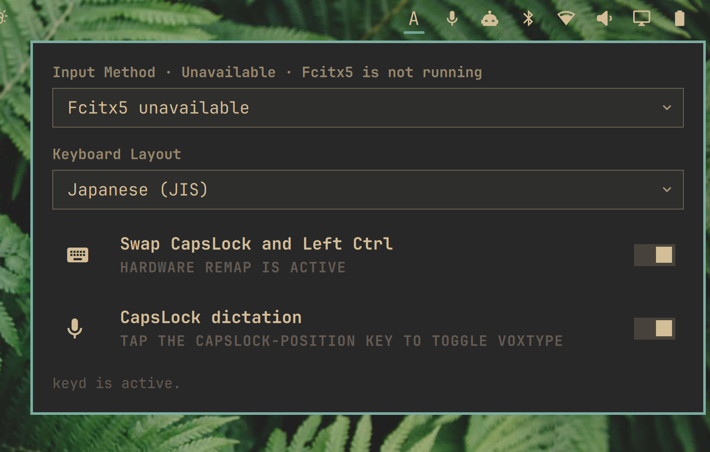
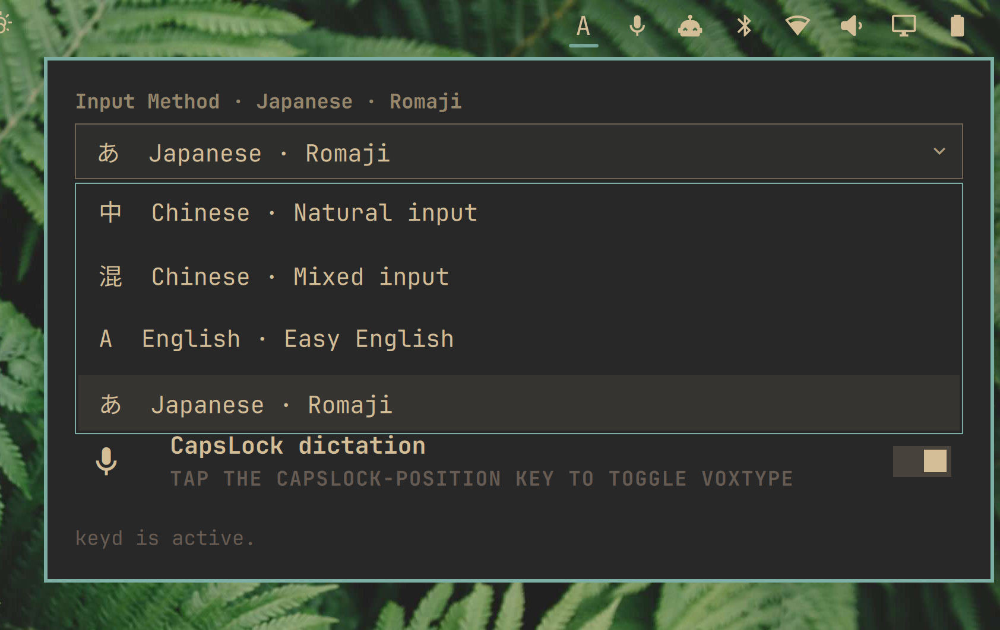

# Keyboard Indicator

Keyboard Indicator is an Omarchy experience-enhancement plugin for keyboard remapping, CapsLock-position dictation, Fcitx5 input methods, and XKB keyboard layouts.

## Features

- Native Omarchy top-bar widget and settings panel.
- Independent toggles for the CapsLock/Left Ctrl swap and CapsLock-position Voxtype dictation.
- Applies to graphical applications, terminals, tmux, SSH sessions, and Hyprland global shortcuts because keyd remaps the input before they receive it.
- Uses keyd and a small system configuration managed through an explicit `pkexec` authentication prompt.
- Remembers the enabled state; keyd continues to run as a system service after shell or Hyprland restarts.
- Keeps the UI and state management in the user session; privileged work is limited to installing/removing the keyd config.

## Installation

```sh
omarchy plugin add https://github.com/iamcheyan/omarchy-keyboard-indicator.git --enable
```

Open the `Keyboard Indicator` keyboard icon in the top bar. The panel follows Omarchy's native theme and uses the shell's `KeyboardPanel`, `ToggleSwitch`, and themed selector patterns.

The plugin automatically reapplies the selected state when the Omarchy shell starts. Disable or remove the plugin to restore the normal mapping and stop the plugin's runtime integration.

## Interface

The default panel puts the active input method and keyboard layout first, followed by the optional keyboard remap and CapsLock-position dictation switches.



_Default panel with the current input method and keyboard layout._

Both selectors use compact dropdown menus so the available input schemes and layouts stay out of the way until needed.



_Expanded input-method selector._

## How it works

When enabled, the plugin generates this keyd configuration:

```text
[ids]
*

[main]
capslock = overload(control, f24)
leftcontrol = capslock
```

The file is installed as `/etc/keyd/hancore-ctrl-swap.conf` after the user approves the `pkexec` prompt. When disabled, only this file is removed and keyd is restarted. The enabled intent is stored at:

```text
~/.local/state/hancore.keyboard-center/enabled
```

## Optional CapsLock-position dictation

The second panel switch registers a binding for the physical key in the
CapsLock position. Press and release that key by itself to run Omarchy's
standard Voxtype toggle command:

```text
voxtype record toggle
```

When the swap is active, keyd uses `overload(control, f24)`: holding the key
with another key keeps normal Ctrl shortcuts such as Ctrl+C and Ctrl+W, while
a standalone tap emits the internal `F24` signal. When the swap is disabled,
a transparent physical-key release binding preserves normal CapsLock behavior
while still toggling Voxtype. This option requires the `voxtype` command.

## Boundary and compatibility notes

- Only Left Ctrl and CapsLock are swapped. Right Ctrl is unchanged.
- This plugin requires one-time administrator authentication when keyd is first installed, and authentication again when the system config is changed.
- It does not install a permissive Polkit rule; authentication is handled by the normal desktop Polkit agent.

## Uninstallation

Disable or remove the plugin through Omarchy's plugin manager. The plugin removes its runtime integration and restores the original keyboard mapping. It does not remove unrelated Hyprland or keyboard configuration.

## Validation

```sh
omarchy plugin validate .
qmllint -I /usr/share/omarchy/shell bar/widget.qml CtrlSwapPanel.qml
python3 -m py_compile scripts/ctrl_swap.py
```

## License

MIT. See [LICENSE](LICENSE).
